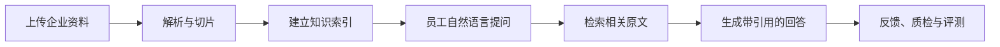

# 火建AI知识管理免费版

> 把散落在文件夹里的制度、手册、产品资料和技术文档，变成员工随时能问、答案有出处的企业知识库。

[](https://github.com/cnbaowen/huojian-ai-knowledge-free/actions/workflows/ci.yml)
[](LICENSE)
[](frontend/package.json)
[](backend/composer.json)
[](docker-compose.yml)

**开源免费 · Docker 一键部署 · 可离线体验 · 回答自带引用 · 资料存储自己掌控**

[快速开始](#五分钟启动) · [三分钟体验](#三分钟体验) · [查看功能](#核心功能) · [安装说明](docs/INSTALL.md) · [配置说明](docs/CONFIGURATION.md)


## 企业资料很多，真正用起来却很难

制度放在共享盘，产品资料散在员工电脑，技术文档藏在聊天记录里。需要时靠人翻目录、问同事、找旧文件，不仅慢，还容易拿错版本、漏掉依据。

火建AI知识管理免费版把这件事变简单：

1. 上传企业资料，系统自动解析、切片并建立检索索引。
2. 员工直接用自然语言提问，不必记文件名和存放位置。
3. 每个回答都展示引用来源，方便回到原文核对。
4. 资料里没有答案时，系统会明确拒答，减少一本正经地编答案。
5. 通过知识质检和 RAG 评测，持续发现资料与回答质量问题。

## 它不只是一个聊天框



从资料进入系统，到回答可核验，再到质量可评测，免费版提供的是一套完整知识管理闭环，而不是只有演示效果的单页 RAG Demo。

## 核心功能

| 功能 | 能解决什么问题 |
| --- | --- |
| 企业知识库 | 按分类管理资料，支持上传、下载、删除、解析状态和知识切片预览 |
| 多格式解析 | 支持 TXT、Markdown、LOG、CSV、JSON、DOCX、XLSX 和可复制文字的 PDF |
| 内部知识问答 | 按知识分类检索，回答展示引用来源，并支持有用/无用反馈 |
| 知识不足拒答 | 找不到可靠依据时不强行给出确定答案，降低错误信息传播风险 |
| 知识质检 | 检查空文档、异常切片等问题，直观看到知识库质量评分 |
| RAG 评测 | 用问题和预期关键词重复验证回答效果，让优化结果有据可查 |
| 模型配置 | 默认本地引用式回答，也可接入 OpenAI 兼容模型接口 |
| 企业微信配置 | 管理群机器人 Webhook，服务端加密保存，并提供配置校验 |
| 运行状态 | 查看知识文档、切片、分类、问答次数和系统健康情况 |

## 六个实际优势

### 1. 回答有出处，员工敢用

回答旁边直接展示引用文档和相关原文。使用者不仅能看到结论，还能判断结论来自哪里、是否适用于当前问题。

### 2. 没有依据就不乱答

知识库内容不足时，系统会提示无法从现有资料确认，而不是为了“有回答”去编造信息。

### 3. 不配置模型密钥也能跑

默认的本地抽取模式不调用外部模型，安装后即可完成上传、检索、引用问答和评测，适合离线演示、内部试用和方案验证。

### 4. 需要时再接入大模型

支持 OpenAI 兼容接口，可配置自己的模型服务。外部模型调用失败时会回退到本地引用回答，基础知识查询仍可继续工作。

### 5. 数据放在自己的环境里

使用独立的 Docker Compose 项目、MySQL 数据库和文档存储卷。资料、索引和配置由部署者自己管理，不依赖外部托管知识库。

### 6. 效果可以重复检查

内置知识质检、RAG 评测和用户反馈，不必只凭一次演示判断效果，可以持续检查资料质量和回答结果。

## 适合这些场景

- 中小企业搭建内部制度、产品资料、技术文档知识库
- 行政、人事、质量、售后或技术团队减少重复查资料、重复答问题
- 项目组集中管理规范、方案、操作手册和交付文档
- 想低成本验证企业知识问答效果的团队
- 希望先在内网或自己的服务器试用，再决定后续建设方案的企业

当前免费版使用统一访问令牌，适合小团队内网使用、产品体验和方案验证。需要组织架构、多角色权限、客户服务、工作流等复杂能力时，应在此基础上另行建设，不建议把免费版描述成完整的大型企业权限平台。

## 产品界面

### 资料统一管理，解析结果看得见


### 直接提问，回答与引用原文同时展示


### 企业微信群机器人配置集中管理


## 五分钟启动

准备一台安装了 Docker Engine 24+ 和 Docker Compose v2+ 的机器。建议至少 2 核 CPU、4 GB 内存和 5 GB 可用磁盘。

```bash
git clone https://github.com/cnbaowen/huojian-ai-knowledge-free.git
cd huojian-ai-knowledge-free
cp .env.example .env
```

修改 `.env` 中的 `APP_KEY`、`DB_PASSWORD`、`DB_ROOT_PASSWORD` 和 `FREE_API_TOKEN`，然后启动：

```bash
docker compose up -d --build
docker compose exec backend php artisan migrate --force
```

浏览器打开 `http://localhost:18080`，输入 `.env` 中配置的 `FREE_API_TOKEN` 即可登录。

Windows PowerShell 复制配置文件：

```powershell
Copy-Item .env.example .env
```

完整安装步骤、应用密钥生成方式和停止服务说明见 [安装说明](docs/INSTALL.md)。

> `docker compose down -v` 会删除免费版数据库和上传文档。除非确定数据不再需要，否则不要使用 `-v`。

## 三分钟体验

仓库已经准备了一份虚构的差旅制度，不需要模型 API Key 就能完成完整体验：

1. 登录后进入“知识治理 → 企业知识库”。
2. 上传 [`demo-data/company-travel-policy.md`](demo-data/company-travel-policy.md)。
3. 等待文档状态变为“已索引”。
4. 进入“内部知识问答”，提问：`差旅报销最晚什么时候提交？`
5. 系统应回答“每月 25 日前”，并展示对应文档引用。
6. 再问一个资料中没有答案的问题，观察系统如何拒绝编造答案。

更多体验步骤见 [三分钟演示脚本](docs/DEMO.md)。

## 模型运行方式

### 本地零密钥模式

```dotenv
MODEL_PROVIDER=local-extractive
MODEL_CHAT_MODEL=local-grounded-v1
```

不调用外部大模型，适合离线体验和功能验证。

### OpenAI 兼容模式

```dotenv
MODEL_PROVIDER=openai-compatible
MODEL_BASE_URL=https://provider.example/v1
MODEL_API_KEY=replace-with-server-secret
MODEL_CHAT_MODEL=provider-model-name
```

模型密钥只应保存在服务器 `.env` 或专用密钥管理系统中，不要提交到 Git。完整参数见 [配置说明](docs/CONFIGURATION.md)。

启用外部模型后，问题和检索命中的知识片段会发送到所配置的模型服务。请根据企业数据安全要求选择服务商和部署方式。

## 部署与安全说明

- 生产环境必须更换 `.env.example` 中的全部占位密码和令牌。
- 建议部署在企业内网、VPN 或受控反向代理之后。
- 不要把后端 `18000` 端口直接暴露到公网。
- 不要将真实客户资料、数据库、日志、模型密钥或 Webhook 提交到 Git。
- 企业微信 Webhook 在服务端加密保存，接口不返回明文。
- 扫描版 PDF 需要先完成 OCR；免费版不包含 OCR 服务。
- 安全问题请按照 [安全政策](SECURITY.md) 私密报告。

<details>
<summary><strong>查看免费版功能边界</strong></summary>

免费版聚焦知识管理和内部知识问答，不包含以下模块：

- AI 客服、微信客服、客户会话、自动回复和人工接管
- CRM、销售线索和跟进记录
- 内容生产、内容发布和情报中心
- 智能体、工作流和 OpenClaw
- 商业许可证、系统升级和商业运维模块

这些模块在免费版的前后端路由和源码层均不存在，不是简单隐藏菜单。

</details>

## 技术栈

- 前端：Vue 3、Element Plus、Vite
- 后端：PHP 8.2+、Laravel 12
- 数据库：MySQL 8.4；本地开发和验收支持 SQLite
- 部署：Docker Compose
- 检索：本地向量、关键词与结构化知识检索
- 模型：本地引用抽取或 OpenAI 兼容接口

## 开发与验证

```bash
composer --working-dir=backend validate --no-check-publish
npm --prefix frontend ci
npm --prefix frontend run build
bash scripts/acceptance-linux.sh
```

Windows：

```powershell
powershell.exe -NoProfile -ExecutionPolicy Bypass -File .\scripts\acceptance.ps1
```

## 文档与社区

- [安装说明](docs/INSTALL.md)
- [配置说明](docs/CONFIGURATION.md)
- [系统架构](docs/ARCHITECTURE.md)
- [演示脚本](docs/DEMO.md)
- [贡献指南](CONTRIBUTING.md)
- [社区支持](SUPPORT.md)
- [安全政策](SECURITY.md)
- [变更记录](CHANGELOG.md)

如果这个项目对你有帮助，欢迎点一个 Star、提交使用反馈，或通过 Issue 分享你的知识管理场景。

## 许可证与品牌

源代码采用 [Apache License 2.0](LICENSE)。`火建AI`、`Huojian AI` 名称和品牌标识不因代码许可证而授权，详见 [NOTICE](NOTICE)。
