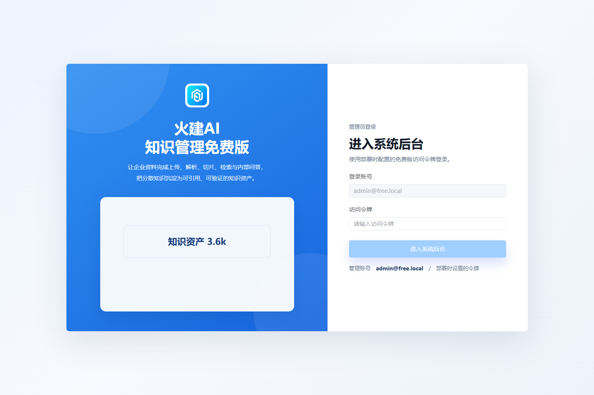

# 火建AI知识管理免费版

[](LICENSE)
[](frontend/package.json)
[](backend/composer.json)
[](docker-compose.yml)

一套可独立部署的企业知识库系统，提供文档上传、解析切片、知识检索、内部问答、引用溯源、质量评测和企业微信群机器人配置。界面沿用火建AI商业版产品语言，但免费版代码、数据、容器和 Git 历史完全独立。

> 当前发布候选：`v0.3.0-rc.2`。代码与技术材料已完成公开发布准备；正式公开前仍需仓库所有者确认品牌主体、安全联系方式和 GitHub 仓库地址。


## 为什么不是普通 RAG Demo

| 能力 | 本免费版 |
| --- | --- |
| 企业资料管理 | 分类、上传、下载、删除、解析状态和切片预览 |
| 文档解析 | TXT、Markdown、LOG、CSV、JSON、DOCX、XLSX、可复制文字 PDF |
| 知识问答 | 分类过滤、知识不足拒答、引用来源和反馈 |
| 质量治理 | 知识质检、异常提示、质量评分和 RAG 评测 |
| 模型运行 | 默认本地引用式回答，可选 OpenAI 兼容接口 |
| 企业微信 | 群机器人 Webhook 加密保存、校验和人工确认测试 |
| 独立部署 | 独立 Compose 项目、数据库、文档卷和发布边界扫描 |

## 五分钟启动

要求 Docker Engine 24+、Docker Compose v2+、至少 2 核 CPU、4 GB 内存和 5 GB 可用磁盘。

```bash
cp .env.example .env
```

修改 `.env` 中的 `APP_KEY`、数据库密码和 `FREE_API_TOKEN`，然后执行：

```bash
docker compose up -d --build
docker compose exec backend php artisan migrate --force
```

打开 `http://localhost:18080`，使用 `.env` 中的 `FREE_API_TOKEN` 登录。

Windows PowerShell 复制配置文件：

```powershell
Copy-Item .env.example .env
```

完整步骤见 [安装说明](docs/INSTALL.md) 和 [配置说明](docs/CONFIGURATION.md)。

## 三分钟体验

1. 登录后进入“知识治理 → 企业知识库”。
2. 上传 [虚构差旅制度](demo-data/company-travel-policy.md)。
3. 进入“内部知识问答”，提问：`差旅报销最晚什么时候提交？`
4. 预期回答包含“每月 25 日前”，并展示可核验的文档引用。

详细演示脚本见 [DEMO.md](docs/DEMO.md)。

## 产品截图

### 企业知识库


### 内部知识问答与引用


### 企业微信机器人


### 登录页面



## 免费版边界

本仓库只包含完整知识管理、内部问答、模型配置和企业微信群机器人配置。它明确不包含：

- AI 客服、微信客服、客户会话、自动回复和人工接管
- CRM、销售线索和跟进记录
- 内容生产、内容发布和情报中心
- 智能体、工作流和 OpenClaw
- 商业许可证、系统升级和商业运维模块

这些模块不仅从菜单隐藏，而且在免费版前后端路由和源码层物理缺失。

## 安全说明

- 不要将 `.env`、模型密钥、真实客户资料、数据库或日志提交到 Git。
- 免费版默认通过高强度 `FREE_API_TOKEN` 登录；生产环境应置于 VPN、内网或受控反向代理之后。
- 企业微信 Webhook 在服务端加密保存，接口不返回明文。
- 扫描版 PDF 需要先做 OCR；免费版不包含商业级 OCR 服务。
- 安全问题请按 [SECURITY.md](SECURITY.md) 私密报告，不要公开漏洞细节。

## 验收与开发

```bash
composer --working-dir=backend validate --no-check-publish
npm --prefix frontend ci
npm --prefix frontend run build
bash scripts/acceptance-linux.sh
bash scripts/release-check.sh
```

Windows：

```powershell
powershell.exe -NoProfile -ExecutionPolicy Bypass -File .\scripts\acceptance.ps1
powershell.exe -NoProfile -ExecutionPolicy Bypass -File .\scripts\container-acceptance.ps1
```

## 文档

- [安装说明](docs/INSTALL.md)
- [配置说明](docs/CONFIGURATION.md)
- [系统架构与免费版边界](docs/ARCHITECTURE.md)
- [演示脚本](docs/DEMO.md)
- [GitHub 发布操作手册](docs/GITHUB_PUBLISHING.md)
- [贡献指南](CONTRIBUTING.md)
- [安全政策](SECURITY.md)
- [社区支持](SUPPORT.md)
- [变更记录](CHANGELOG.md)

## 许可证与品牌

源代码采用 [Apache License 2.0](LICENSE)。`火建AI`、`Huojian AI` 名称和品牌标识不因代码许可证而授权，详见 [NOTICE](NOTICE)。

本发布候选由仓库外独立构建器生成，没有携带商业版 Git 历史、客户数据、密钥、数据库、备份或运行日志。
