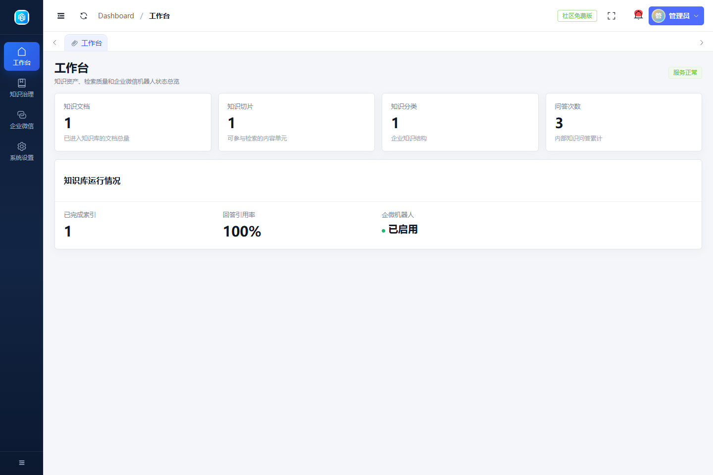
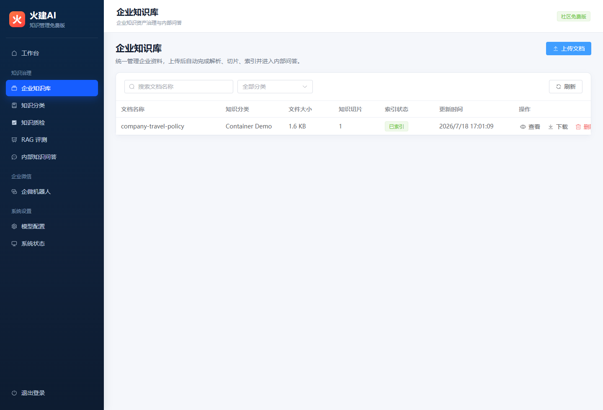
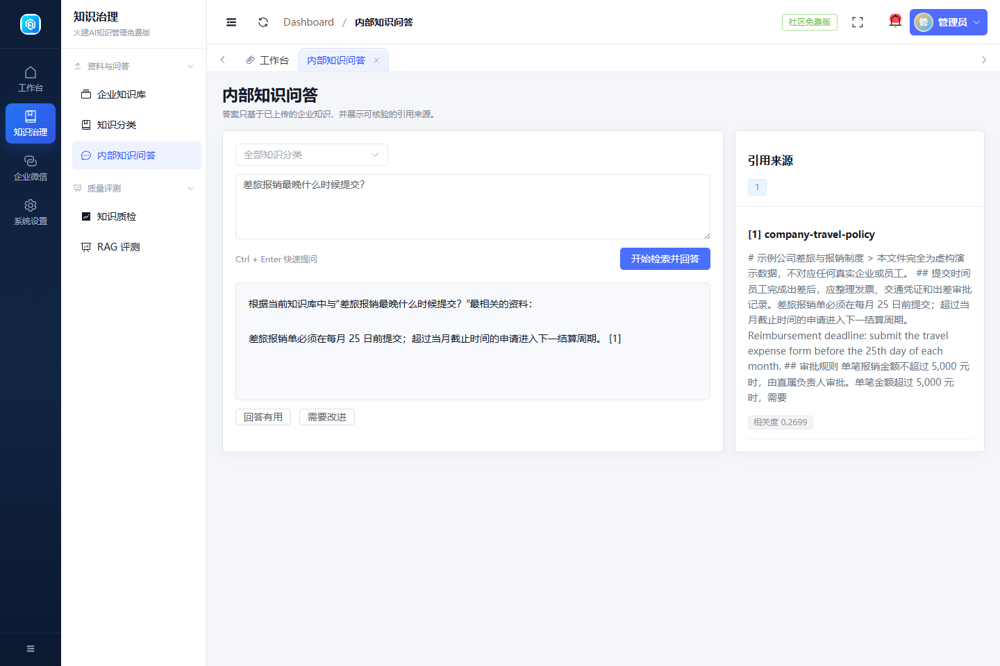
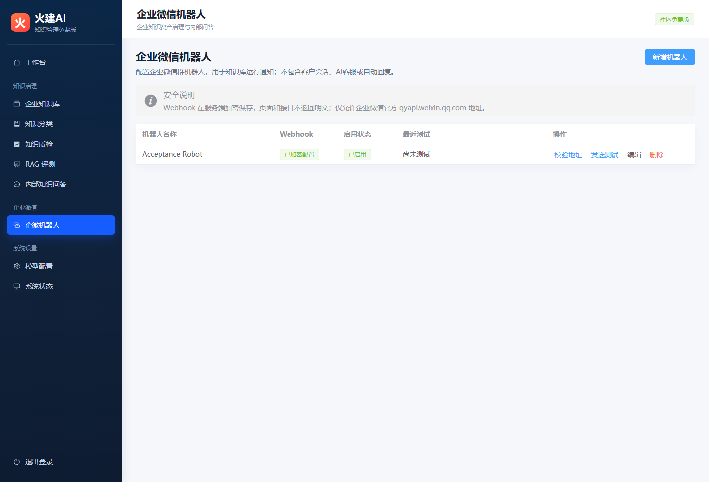

# Huojian AI Knowledge Management Free Edition

[简体中文](README.md) | [English](README_EN.md)

> Turn policies, manuals, product materials, and technical documents into a self-hosted knowledge base your team can query—with every answer linked to its source.

[](https://github.com/cnbaowen/huojian-ai-knowledge-free/actions/workflows/ci.yml)
[](LICENSE)
[](frontend/package.json)
[](backend/composer.json)
[](docker-compose.yml)

**Free and open source · One-command Docker deployment · Offline-ready · Source-grounded answers · Self-hosted data**

[Quick start](#five-minute-setup) · [Try the demo](#three-minute-demo) · [Features](#core-features) · [Installation](docs/INSTALL.md) · [Releases](https://github.com/cnbaowen/huojian-ai-knowledge-free/releases)



## Make scattered company knowledge useful

Important information often lives across shared drives, employee laptops, old chat messages, and deeply nested folders. Finding the right document takes time, and an outdated answer can be worse than no answer at all.

Huojian AI Knowledge Management Free Edition provides a practical workflow:

1. Upload company documents and automatically parse, chunk, and index them.
2. Ask questions in natural language without knowing the file name or folder.
3. Review the source document and supporting excerpt beside every answer.
4. Refuse unsupported questions when the knowledge base does not contain reliable evidence.
5. Improve content and retrieval quality through checks, RAG evaluations, and user feedback.

## More than a chat box


The project connects document management, retrieval, grounded answers, source review, and quality evaluation in one maintainable workflow.

## Core features

| Feature | What it provides |
| --- | --- |
| Knowledge library | Category-based document management, upload, download, deletion, processing status, and chunk preview |
| Multi-format parsing | TXT, Markdown, LOG, CSV, JSON, DOCX, XLSX, and text-based PDF files |
| Internal knowledge Q&A | Category-aware retrieval, cited answers, source excerpts, and helpful/unhelpful feedback |
| Evidence-based refusal | Avoids presenting a confident answer when no reliable source is found |
| Knowledge quality checks | Detects empty documents, abnormal chunks, and other content-quality issues |
| RAG evaluation | Re-runs test questions and expected keywords to measure retrieval and answer quality |
| Flexible model setup | Works in local extractive mode or with an OpenAI-compatible model endpoint |
| WeCom group bot | Stores and validates encrypted group-bot webhook configuration |
| System dashboard | Shows document, chunk, category, Q&A, and service-health statistics |

## Why use it

### Answers users can verify

Every supported answer includes the source document and relevant excerpt, so users can check whether the information is current and applicable.

### No forced answers without evidence

When the knowledge base cannot support a question, the system says so instead of inventing a plausible response.

### Works without an external model key

Local extractive mode supports upload, retrieval, cited answers, and evaluation without calling an external large language model. It is suitable for offline and controlled-network environments.

### Connect your own model when needed

An OpenAI-compatible endpoint can be configured for more natural responses. If the external model is unavailable, the system can fall back to local source-grounded output.

### Keep data in your environment

The Docker Compose stack uses dedicated application services, MySQL storage, document storage, and a vector index. Documents, indexes, and configuration remain under the deployer's control.

### Evaluate improvements repeatedly

Built-in quality checks, RAG evaluations, and feedback make it possible to measure results beyond a single demo question.

## Good fit for

- Small and medium-sized teams building an internal policy, product, or technical knowledge base
- HR, administration, quality, after-sales, and technical teams handling repeated information requests
- Project teams managing specifications, procedures, manuals, and delivery documents
- Organizations that want a low-cost, self-hosted knowledge Q&A starting point
- Teams deploying inside their own server, intranet, VPN, or controlled cloud environment

The current edition uses a deployment-level access token and is designed for one team in a controlled environment. It does not currently include organization directories or fine-grained role-based permissions.

## Product screenshots

### Manage documents and review processing status



### Ask questions and inspect the cited source text



### Manage WeCom group-bot configuration



## Five-minute setup

Requirements: Docker Engine 24+, Docker Compose v2+, 2 CPU cores, 4 GB RAM, and 5 GB of available disk space are recommended.

```bash
git clone https://github.com/cnbaowen/huojian-ai-knowledge-free.git
cd huojian-ai-knowledge-free
cp .env.example .env
```

Set `APP_KEY`, `DB_PASSWORD`, `DB_ROOT_PASSWORD`, and `FREE_API_TOKEN` in `.env`, then start the services:

```bash
docker compose up -d --build
docker compose exec backend php artisan migrate --force
```

Open `http://localhost:18080` and sign in with the `FREE_API_TOKEN` configured in `.env`.

On Windows PowerShell, copy the environment template with:

```powershell
Copy-Item .env.example .env
```

See the [installation guide](docs/INSTALL.md) for key generation, detailed requirements, and shutdown instructions.

> `docker compose down -v` deletes the free-edition database and uploaded documents. Do not use `-v` unless you intend to remove the stored data.

## Three-minute demo

The repository includes a fictional company travel policy, so the complete workflow can be tested without a model API key:

1. Open **知识治理 → 企业知识库** (**Knowledge Governance → Knowledge Library**) after signing in.
2. Upload [`demo-data/company-travel-policy.md`](demo-data/company-travel-policy.md).
3. Wait until the document status becomes indexed.
4. Open **内部知识问答** (**Internal Knowledge Q&A**) and ask: `差旅报销最晚什么时候提交？` (`When must travel expenses be submitted?`).
5. Review the answer and the cited source excerpt.
6. Ask a question that is not covered by the document and observe the evidence-based refusal.

See the [demo guide](docs/DEMO.md) for the full walkthrough. The application interface and bundled demo document are currently in Chinese.

## Model modes

### Local, zero-key mode

```dotenv
MODEL_PROVIDER=local-extractive
MODEL_CHAT_MODEL=local-grounded-v1
```

This mode does not call an external large language model and is suitable for offline or restricted-network deployments.

### OpenAI-compatible mode

```dotenv
MODEL_PROVIDER=openai-compatible
MODEL_BASE_URL=https://provider.example/v1
MODEL_API_KEY=replace-with-server-secret
MODEL_CHAT_MODEL=provider-model-name
```

Keep model credentials in the server-side `.env` file or a dedicated secret manager, never in Git. When an external model is enabled, the question and retrieved knowledge excerpts are sent to the configured provider. Choose the provider and deployment model according to your data-security requirements.

## Known limitations and security notes

- Scanned or image-only PDFs require OCR before upload; OCR is not bundled.
- Local extractive mode focuses on controlled retrieval and citations rather than generative writing.
- The current authentication model uses one deployment-level access token.
- The application interface, bundled demo data, and detailed documentation are currently Chinese-first.
- Replace all placeholder passwords and tokens before deployment.
- Deploy behind an intranet, VPN, or controlled reverse proxy, and do not expose backend port `18000` directly to the internet.
- Never commit customer documents, databases, logs, model keys, tokens, or webhook URLs.
- Report vulnerabilities privately according to the [security policy](SECURITY.md).

## Technology stack

- Frontend: Vue 3, Element Plus, and Vite
- Backend: PHP 8.2+ and Laravel 12
- Database: MySQL 8.4; SQLite is supported for local development and acceptance tests
- Deployment: Docker Compose
- Retrieval: local vectors, keywords, and structured knowledge retrieval
- Models: local source extraction or an OpenAI-compatible endpoint

## Downloads and documentation

- [GitHub Releases](https://github.com/cnbaowen/huojian-ai-knowledge-free/releases)
- [Gitee mirror](https://gitee.com/xiaoguozhou/huojian-ai-knowledge-free)
- [Installation guide](docs/INSTALL.md)
- [Configuration reference](docs/CONFIGURATION.md)
- [Architecture](docs/ARCHITECTURE.md)
- [Demo guide](docs/DEMO.md)
- [Contributing](CONTRIBUTING.md)
- [Community support](SUPPORT.md)
- [Security policy](SECURITY.md)
- [Changelog](CHANGELOG.md)

If this project is useful to your team, consider starring the repository, opening an issue, or sharing your knowledge-management use case.

## License and trademark

The source code is licensed under the [Apache License 2.0](LICENSE). The names `火建AI` and `Huojian AI`, along with their brand assets, are not licensed under the source-code license. See [NOTICE](NOTICE) for details.
